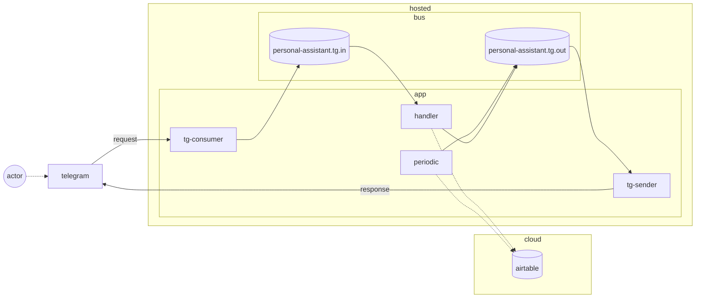

# tg-personal-assistant

- Consumes events from NATS JetStream topic
- Handles the logic
- Sends events back for tg-dispatcher to process replies

## Design

```mermaid
graph LR
  actor((actor))
  telegram

  subgraph cloud
    airtable[(airtable)]
  end

  subgraph hosted
    subgraph bus
      personal-assistant.tg.in[(personal-assistant.tg.in)]
      personal-assistant.tg.out[(personal-assistant.tg.out)]
    end

    subgraph app
      tg-consumer
      tg-sender

      handler
      periodic
    end
  end

  actor -.-> telegram

  tg-consumer --> personal-assistant.tg.in
  personal-assistant.tg.out --> tg-sender

  handler -.-> airtable
  periodic -.-> airtable

  periodic --> personal-assistant.tg.out

  telegram -->|request| tg-consumer
  personal-assistant.tg.in --> handler --> personal-assistant.tg.out
  tg-sender -->|response| telegram
```
